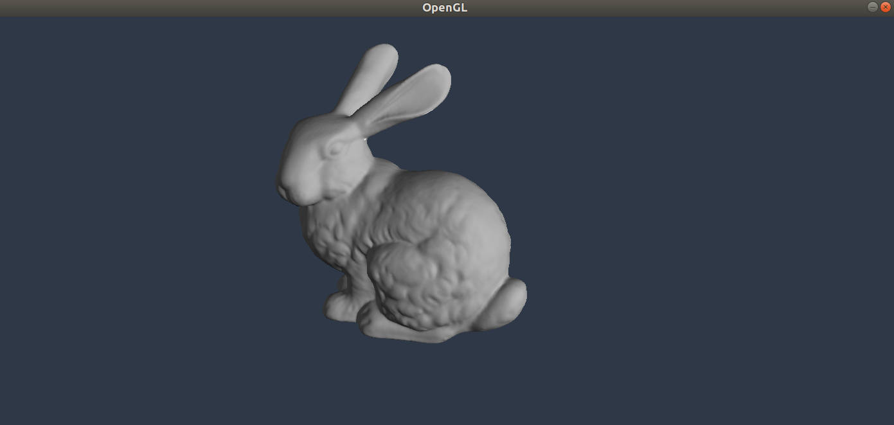
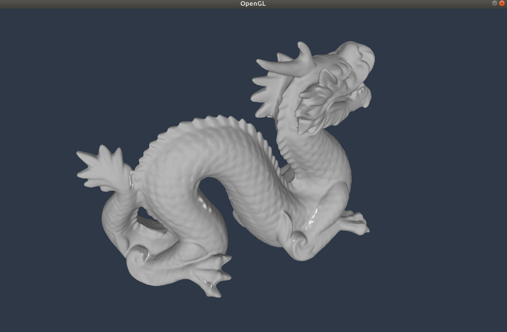
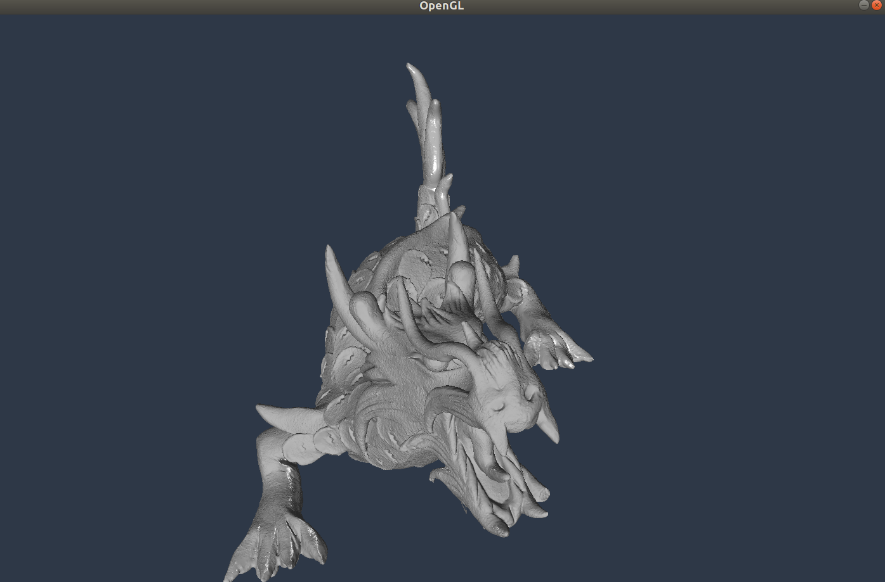

# RENDER

Stanford Bunny (~400k vertices)

Stanford Dragon (~2 million vertices)

Happy Buddha (~3.2 million vertices)

Asian Dragon (~20 million vertices)

Note: these models are not mine, please see below for link.

Models: http://graphics.stanford.edu/data/3Dscanrep/ 
OBJ file specification: https://www.cs.cmu.edu/~mbz/personal/graphics/obj.html
