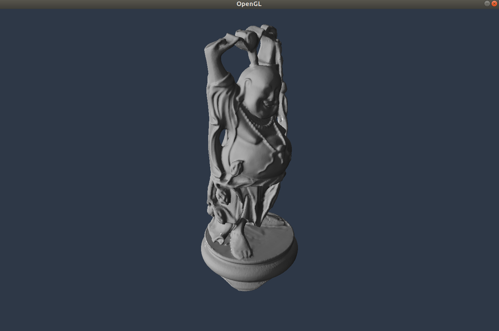

# RENDER


Stanford Bunny (~400k vertices)


Stanford Dragon (~2 million vertices)



Happy Buddha (~3.2 million vertices)


Asian Dragon (~20 million vertices)


Note: these models are not mine, please see below for link.


Models: http://graphics.stanford.edu/data/3Dscanrep/ 
OBJ file specification: https://www.cs.cmu.edu/~mbz/personal/graphics/obj.html

--------------
How to do shadow maps:

It is necessary to generate a shadow map for each light source present in the scene. This is because a shadow map is rendered with the perspective of a particular light source.
Since shadow maps are clearly associated with a light source, it would be convenient to pass to shaders various properties of a light (e.g. position, gaze, etc.) along with the shadow map texture sampler for that particular light source together as a single structure into GLSL.

That is: 
```glsl
struct Light {
	sampler2DShadow shadow;
	vec3 position;
	vec3 intensity;
	...
};
```

Then, in the fragment shader, the color of each fragment can be conveniently computed:

```
for each light:
	shadowMap = light.shadow
	sample shadowMap
	if fragment is in shadow
		set blinn-phong shading 
```

Unforutnately, we cannot do this since GLSL does not allow Samplers to be defined within structures. The alternative is to use 2D array textures, where the shadow map for each light source is stored as a layer in the texture.
For example:
A 2D array texture defined to store shadow map texture data for 3 light sources is as follows:

```C++
  GLuint tex;
  glGenTextures(1, &tex);
  glBindTexture(GL_TEXTURE_2D_ARRAY);
  glTexStorage3D(GL_TEXTURE_2D_ARRAY,     // allocates storage to texture binded to GL_TEXTURE_2D_ARRAY
                 1,                       // mipmap level
                 GL_DEPTH_COMPONENT32,    // internal format
                 width,                   
                 height,
                 3);                      // # layers
```

Note the use of `glTexStorage3D` (and not, say, glTexStorage2D). Internally, a 2D array texture is simply a 3D array, where the primary and secondary indices are the texture coordinates (i.e. u,v or s,t) and the tertiary index is the layer index (cf. 3D arrays). 

Whether for one or multiple light sources, the shadow map of each light source must first be rendered, so it/they can be used in the main render. Whereas typically the main render writes pixel data directly to window display (via writing to the default back buffer), the goal of shadow maps is not to be displayed, and therefore should not be rendered to the display. Therefore, there need be some mechanism for the application to instruct OpenGL to write the render result to a separate memory location (i.e. one that is not the default buffers used for display rendering). Such buffers can be defined using the Framebuffer mechanism provided by OpenGL.

To make clear, it should be noted that the results of each shadow map render must be placed in the memory allocated from `glTexStorage*` (use '\*' to denote wildcard). Ultimately, the main rendering program accesses the shadow map as if it were a texture.

With this in mind, framebuffers offers a mechanism by which to connect OpenGL's rendering output to data storage buffers such as textures, VBOs, etc.. It is useful to think about framebuffers as a proxy between the application and OpenGL. It functions much like a telephone switchboard. There are 2 logical sides for a framebuffer: the application side, and the OpenGL side. Without too much detail, framebuffers, on the application side, allow the application to attach storage units such as textures to fixed attachment points. On the OpenGL side, framebuffers allow the application to choose which attachment points to write rendered data into. For a framebuffer to be configured correctly, all attachment points must have been attached from both the application and OpenGL side, so that, once rendered, the pixel data can be delivered to the storage unit as configured.

In pseudo-OpenGL:
```C++
  GLuint tex, fbo;

  ... // Initialize FBO, Texture

  // Application-side: connect texture to GL_COLOR_ATTACHMENT0
  glBindFramebuffer(GL_FRAMEBUFFER, fbo);
  glFramebufferTexture(GL_FRAMEBUFFER,
                       GL_COLOR_ATTACHMENT0,
                       tex,
                       0);

  // OpenGL-side: connect rendering target to GL_COLOR_ATTACHMENT0
  glNamedFramebufferDrawBuffer(fbo, GL_COLOR_ATTACHMENT0);
```

Shadow map render - multiple light-sources (2D array texture):

```C++
  GLuint tex, fbo;
  glGenTextures(1, &tex);
  glGenFramebuffers(1, &fbo);

  glBindTexture(GL_TEXTURE_2D_ARRAY, tex);
  glTexStorage3D(GL_TEXTURE_2D_ARRAY,     // allocates storage to texture binded to GL_TEXTURE_2D_ARRAY
                 1,                       // mipmap level
                 GL_DEPTH_COMPONENT32,    // internal format
                 width,                   
                 height,
                 3);                      // # layers

  
  ... // Set texture parameters

  glBindFramebuffer(GL_FRAMEBUFFER, fbo);
  int i;
  for (Light &light : lights) {
    glFramebufferTextureLayer(GL_FRAMEBUFFER,       
                              GL_DEPTH_ATTACHMENT, 
                              tex,                 
                              0,
                              i); // layer #
    // Goes to currently binded FBO
    glDrawBuffer(GL_DEPTH_ATTACHMENT);

    ...  // Render scene

    i++;
  }
```

In the main render, the shadow map must be attached as a `GL_TEXTURE_2D_ARRAY`.
